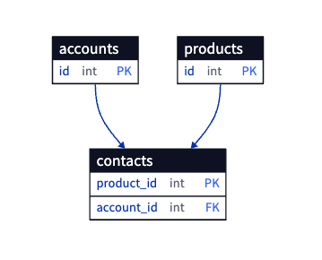

# 2. 무단횡단

- 컬럼에 여러 개의 값을 넣지 마세요. 스키마 변경을 원하지 않거나 별도의 목적을 위해 ‘,’ 로 구분된 여러 개의 값을 하나의 셀에 집어넣지 마세요.
- 이는 여러 개의 FK가 하나의 필드 안에 모두 들어가있는 것을 의미합니다.
- 조회 시 패턴 매칭을 사용해야 하며 인덱스도 활용하지 못합니다.
- 집계 쿼리를 작성하는 것도 매우 불편해집니다.
- 값을 수정하는 것도 어렵습니다.
- 유효성 검증은 어떻게 할 건가요?
- 구분자 문자는 과연 입력하려는 값에서 절대 등장하지 않는다고 보장할 수 있나요?
- 아마 값을 저장하기 위해 문자열을 타입을 사용할텐데, 길이 제한이 끝나는 순간엔 어떻게 대응하실 건가요?
- 허용되는 유일한 시점은 반정규화 시점입니다.
- 대신 교차 테이블을 생성해 사용하세요.

