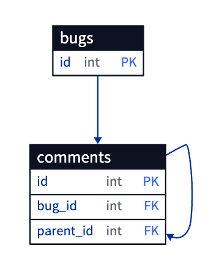

# 3. 순진한 트리

- 댓글과 대댓글을 저장하는 재귀 형태의 데이터를 저장할 땐 어떤 방식을 사용하시나요?
- 항상 부모 댓글을 의존하는 것은 좋지 않습니다. 일반적으론 아래와 같은 경우를 의미합니다.
- 셀프 조인을 사용해 자신의 부모를 명시하는 법이죠.

- 하지만 이런 관계에선 부모의 바로 아래 단계밖에 조회하지 못하는 단점이 존재합니다.
    - 만약 정책 상으로 댓글의 대댓글은 1개만 가능하다는 이상한(?) 정책이 존재한다면 상관없겠지만, 일반적으로 대댓글은 N개 이상의 댓글을 부모 댓글에 작성 가능하도록 허용하는 것이 일반적입니다.
- 만약 위 구조에서 1번 댓글에 대해서 2번 댓글이 작성되고, 2번 댓글을 부모로 하는 3번 댓글이 작성됐다고 가정해봅시다.
    - 이 경우 1번 댓글의 하위 댓글을 모두 찾기 위해선 LEFT OUTER JOIN을 사용해 1번까지 거슬로 올라가야합니다.
    - 즉 대댓글이 몇개인지를 알고 있고 이를 JOIN 절에 명시해야만 조회가 가능하다는 치명적인 문제가 존재합니다.
    - 삭제도 마찬가지입니다.
- 이 때 우리가 선택할 수 있는 대안은 아래와 같습니다.
    1. 경로 열거 (Path Enumeration)
        - 기존 방식이 parent_id 라는 특정 컬럼이 단일값을 통해 조상을 명시했다면, 이 대안은 문자열로 조상을 명시합니다.
        - path 타입을 통해 1/ ,1/2, 1/2/3, 1/4/5 등의 값을 통해 경로를 명시합니다.
        - 하지만 유효성 검증 절차가 애플리케이션을 통하고 정보를 중복 저장하는 단점이 존재합니다.
        - 브레드크럼을 통해 사용자 인터페이스에 명시가 가능합니다.
    2. 중첩 집합 (Nested Sets)
        - nsleft, nsright 컬럼을 통해 자신의 좌측 트리와 우측 트리의 식별자를 명시합니다.
        - 트리를 깊이 우선 탐색을 진행하며 값을 할당하면 간편하게 진행할 수 있습니다.
        - 트리를 수정하는 일이 거의 없고 조회를 주로 수행한다면 적합합니다.
    3. 클로저 테이블 (Closure Table)
        - 계층 구조를 데이터와 분리해 별도로 저장하는 방법입니다.
        - 클로저 테이블엔 트리 구조에 대한 정보, 즉 조상과 자손 관계의 노드 쌍을 하나의 레코드로 대응시켜 저장합니다.
            
            
            
        - 계산을 줄어들지만 저장 공간이 많이 사용됩니다.
- 위 방법 외에도 인접 목록에서 WITH, CONNECT BY PRIOR 키워드를 통한 재귀적 쿼리를 사용해 효율적으로 만들 수 있지만 이는 데이터베이스 벤더에 따라 다릅니다.