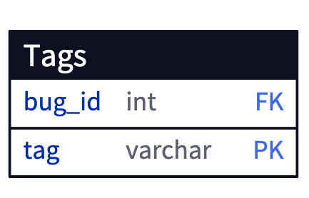

# 8. 다중 컬럼 속성

- 연락처를 저장할 테이블을 만든다고 가정해보자. 이 때 연락처는 한 사람에 대해 여러 개를 가질 수 있다. 어떻게 설계할 것인가?
    - 이 때 발생하는 안티패턴 중 하나는 여러 개의 컬럼을 사용하는 것이다.
- 태그를 사용해 발생한 버그를 마킹하는 예시로 살짝 방향을 돌려보자.
    - 버그가 발생할 때마다 프로그램이 죽는다면 `crash`, 성능 상의 문제라면 `performance` , 디자인과 관련된 문제라면 `cosmetic` 을 마킹한다고 가정해보자. 또한 이런 태그는 여러 개가 하나의 버그에 모두 달리는 것도 가능하다.
    - 이 때 우린 가장 쉽게 `tag1`, `tag2`, `tag3` 컬럼을 생성하는 지독한 안티패턴으로 문제를 해결할 수 있다.
- 여기서 발생하는 문제는 아래와 같다.
    - 먼저 버그를 조회해야한다면 우린 모든 컬럼을 비교해야한다.
    - 값을 추가하거나 삭제할 때도 문제다. 어떤 컬럼이 비어있는지 알 수 없기에 모든 컬럼을 조회하여 비어있는 곳을 파악한 뒤 추가하거나 삭제해야 한다.
        - 심지어 다른 트랜잭션에서 수정을 진행하고 있다면 동시성 문제도 생긴다. 덮어쓰기가 될수도 있기 때문이다.
        - 이 경우에는 `NULLIF` 라는 함수를 사용해 처리할수도 있지만 그리 바람직해 보이지 않는다.
    - 그리고 세 개의 컬럼 모두에 동일한 태그가 붙는 것도 가능하다.
    - 심지어 만약 태그를 4개 혹은 더 늘려야한다면? 어떻게 대응할 것인가. 그 때마다 컬럼을 추가할텐가?
- 이를 해결할 수 있는 방법을 소개한다.
    - 첫 번째는 다중값 속성을 만드는 컬럼을 갖는 종속 테이블을 생성하는 것이다. 여러 컬럼이 아닌 여러 행에 저장하는 2장에서의 해결책과 유사하다.
        

        
    - `bug_id` 와 `tag` 는 복합 PK로 존재하고 `bug_id` 컬럼을 통해 어떤 버그가 어떤 태그를 갖는지 명시한다.
    - 이는 위에서 발생하는 모든 문제를 해결할 수 있다.